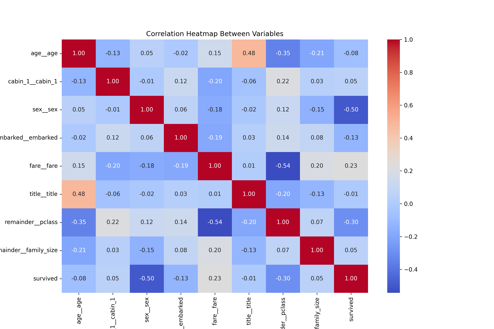
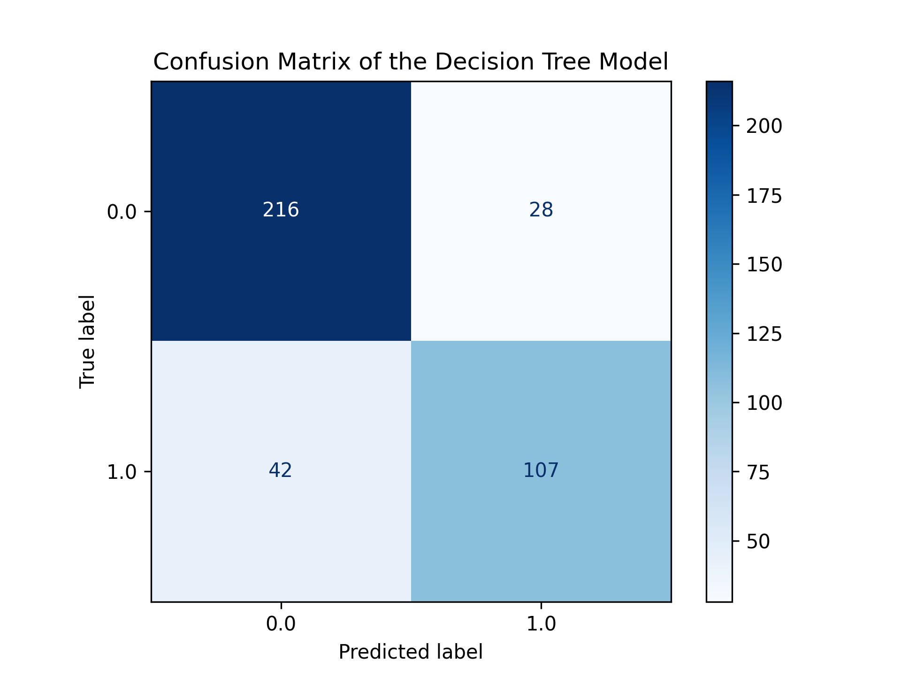
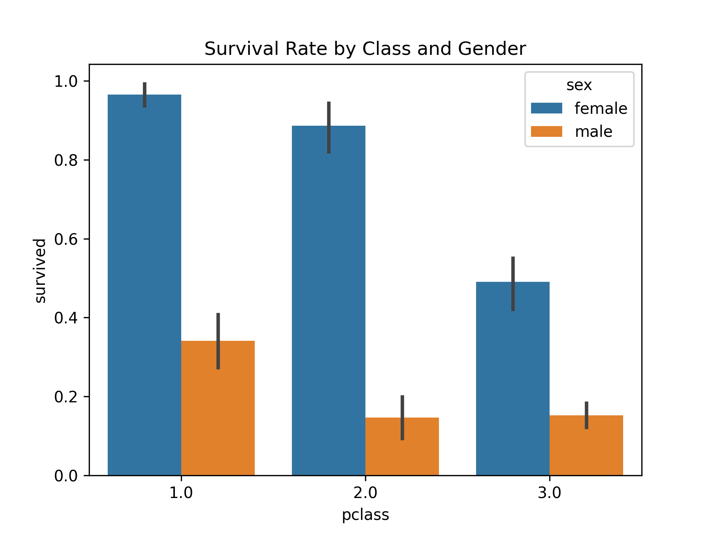
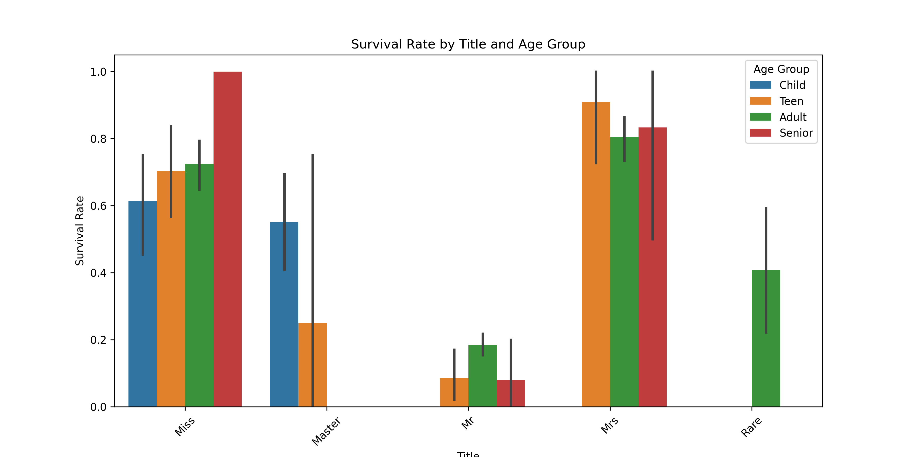
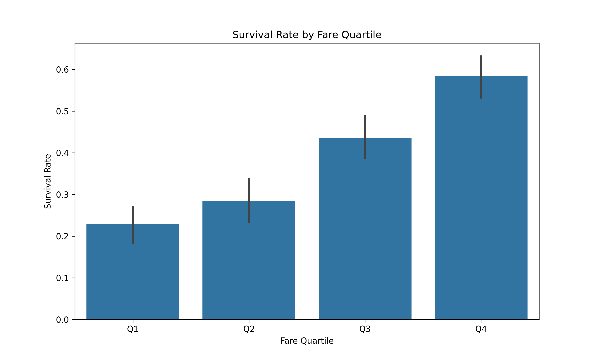
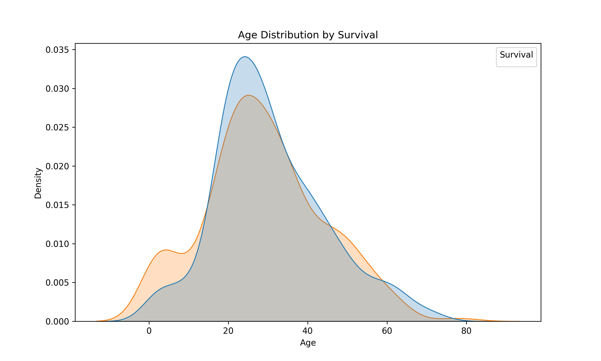

# 🚢 Titanic Survival Prediction - Machine Learning Project  

## 📌 Project Description  
This project applies **Machine Learning** techniques to predict whether a passenger survived the Titanic disaster.  
The dataset contains demographic and socio-economic information about the passengers, and the goal is to create a **predictive model** that accurately classifies survivors and non-survivors.  

## 🛠 Technologies Used  
- **Python**  
- **Pandas** (Data manipulation)  
- **Scikit-learn** (Machine Learning model training & evaluation)  
- **Matplotlib & Seaborn** (Data visualization)  
- **Google Colab / Jupyter Notebook**  

---
## 📂 Repository Structure  

📂 Titanic_Survival_Prediction  
├── 📄 README.md (Project documentation)  
├── 📂 data/ (Dataset files)  
├── 📂 notebooks/ (Jupyter/Colab Notebooks with full code)  
├── 📂 scripts/ (Python scripts for model training and evaluation)  
├── 📄 requirements.txt (List of necessary libraries)  
├── 📂 results/ (Graphs, visualizations, and final model evaluation)  


## 📊 Dataset Overview  

The dataset consists of **1,310 rows** and **14 features**. Below is a description of each variable:  

- **`pclass`**: Passenger class (1st, 2nd, or 3rd class).  
- **`survived`**: Survival indicator (1 = survived, 0 = did not survive).  
- **`name`**: Name of the passenger.  
- **`sex`**: Gender of the passenger.  
- **`age`**: Age of the passenger.  
- **`sibsp`**: Number of siblings/spouses aboard.  
- **`parch`**: Number of parents/children aboard.  
- **`ticket`**: Ticket number.  
- **`fare`**: Fare paid for the ticket.  
- **`cabin`**: Cabin number.  
- **`embarked`**: Port of embarkation.  
- **`boat`**: Lifeboat number (if survived).  
- **`body`**: Identification number of the body (if did not survive).  
- **`home.dest`**: Destination of residence.  

---

## 🔎 **Exploratory Data Analysis (EDA) & Data Preprocessing**  

### **1️⃣ Handling Missing Values**  
- **`age`**, **`fare`**, and **`embarked`** were **imputed using different techniques**:  
  - **K-Nearest Neighbors (KNN Imputer)**  
  - **Mean / Median Imputation**  
  - **Mode (for categorical values)**  
- **`cabin`**, **`boat`**, and **`body`** had excessive missing values and were **dropped**.  

### **2️⃣ Feature Engineering & Column Transformer**  
- Created a **new feature** `family_size = sibsp + parch + 1`.  
- Extracted **titles** from names (e.g., Mr., Miss, Master, etc.) and grouped rare titles.  
- Converted categorical variables (`sex`, `embarked`, `cabin_1`) into numerical values using **`OrdinalEncoder`**.  
- Normalized `age` and `fare` using **`StandardScaler`** to prevent scale bias.  

### **3️⃣ Data Splitting for Machine Learning**  
- **Training & Testing Split (80/20)** → `X_train`, `X_test`, `y_train`, `y_test`.  
- **Validation Split (80/20 within training)** → `X_train_val`, `X_test_val`, `y_train_val`, `y_test_val`.  

---

## 📈 Machine Learning Models & Hyperparameter Tuning  

**The following models were tested:**  
1️⃣ **Logistic Regression**  
2️⃣ **Decision Tree**  
3️⃣ **Random Forest**  
4️⃣ **Support Vector Machine (SVM)**  

### **Hyperparameter Optimization**  
- Used **`GridSearchCV`** for hyperparameter tuning.  
- Regularization (`C` values) and different kernels were tested for **SVM**.  
- Depth (`max_depth`) and split criteria (`min_samples_split`) were adjusted for **Decision Tree & Random Forest**.  

### **Model Performance Comparison**  

| **Model**                 | **Accuracy**|**Precision**| **Recall**| **F1 Score**|
|---------------------------|-------------|-------------|------------|-------------|
| **Decision Tree**         | **0.8364**  | **0.8000**  | **0.7619** | **0.7805**  |
| **SVM**                   | 0.8036      | 0.7383      | 0.7524     | 0.7453      |
| **Logistic Regression**   | 0.8036      | 0.7576      | 0.7143     | 0.7353      |
| **Random Forest**         | 0.7927      | 0.7449      | 0.6952     | 0.7192      |

## 🎨 **Data Visualizations Used**
📊 **Data distribution & missing values:**  
- **Bar charts** (e.g., survival rate by class and gender).  
- **Boxplots** (to detect outliers in age and fare).  
- **Heatmaps** (to analyze feature correlations).  

📉 **Model evaluation:**  
- **Confusion matrix** to analyze false positives/negatives.  
- **Precision-Recall & ROC Curves** to compare model performance.  

---

## 🚀 **Final Model Selection & Conclusion**
📌 **Best Model:** **Decision Tree** (Accuracy **83.64%**)  
📌 **Why?**  
- Highest **accuracy and F1 score**, showing strong performance in classifying survivors and non-survivors.  
- Balanced **precision and recall**, meaning it correctly identifies survivors while keeping false positives low.  
- Performs better than **Random Forest, SVM, and Logistic Regression**.  

### **Final Decision:**
💡 **The Decision Tree model is chosen for final training using 100% of the data.**  

---
## 🔥 Data Visualizations  

### 🔹 Heatmap of Feature Correlations  
  

### 🔹 Confusion Matrix - Decision Tree  
  

### 🔹 Survival Rate by Class and Gender  
  

### 🔹 Survival Rate by Title and Age Group  
  

### 🔹 Survival Rate by Fare Quartile  
  

### 🔹 Age Distribution by Survival  
 
---


## 🚀 **How to Run the Project**  

1️⃣ **Clone the repository**  
```bash
git clone https://github.com/yourusername/Titanic_Survival_Prediction.git
cd Titanic_Survival_Prediction


2️⃣ **Install dependencies**  
```bash
pip install -r requirements.txt


3️⃣ **Run the Jupyter Notebook (Google Colab recommended):**  
```python
import pandas as pd
Data = pd.read_csv('data/titanic5.csv')
Data.head()


## 📎 References  
- [Titanic Dataset - Kaggle](https://www.kaggle.com/c/titanic)  
- [Scikit-learn Documentation](https://scikit-learn.org/stable/)  


🏆 Author
👤 Rocio Yut
📧 rocio.yut@gmail.com
🔗 GitHub Profile: Rocio7531
